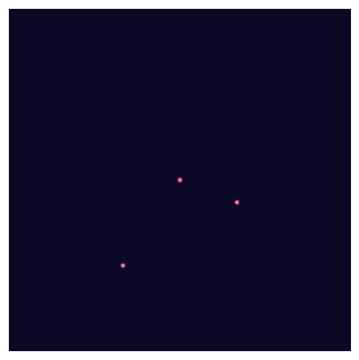

# Métodos numéricos para ecuaciones en derivadas parciales


[](https://creativecommons.org/licenses/by/4.0/)
[](https://mybinder.org/v2/gh/nicoguaro/metodos_numericos_edp_20261/HEAD)
[](https://colab.research.google.com/github/nicoguaro/metodos_numericos_edp_20261)


Este es el repositorio con el maaterial para el curso de Métodos Numéricos para
Ecuaciones en Derivadas Parciales de la Universidad EAFIT para el 2026.




La animación anterior presenta la solución para la ecuación de
[reacción-difusión](https://en.wikipedia.org/wiki/Reaction%E2%80%93diffusion_system)
para el modelo de Gray-Scott sobre un dominio periódico. La solución fue
encontrada con el método de diferencias finitas con esquema explícito de
integración en el tiempo. El código estará disponible en una actualización
reciente del repositorio.


## Instrucciones de instalación

Recomendamos usar ``conda`` para instalar los paquetes necesarios para este
curso. Se requieren dependencias ajenas a Python, lo que hace que la
instalación manual o con ``pip`` un poco compleja.


Cree un entorno conda usando el archivo ``environment.yml`` en la raíz del
repositorio usando

```console
conda env create -f environment.yml
```

Esto creará un ambiente de conda llamado `metodos_edp` con todos los paquetes
necesarios.

Puedes activar el ambiente con

```console
conda activate metodos_edp
```

## Verificando la instalación

Tras la instalación, puede comprobar si todo está instalado.

```console
python check_install.py
```

Para comprobar si todo funciona, ejecute las demostraciones con

```console
python demo.py
```

## Licencia

Todo el código está bajo licencia MIT y el contenido bajo licencia Creative Commons Attribute.

El contenido de este repositorio está bajo licencia bajo la
[Licencia Creative Commons Attribution 4.0](http://choosealicense.com/licenses/cc-by-4.0/),
y el código fuente que acompaña al contenido tiene 
[Licencia MIT](https://opensource.org/licenses/mit-license.php).
